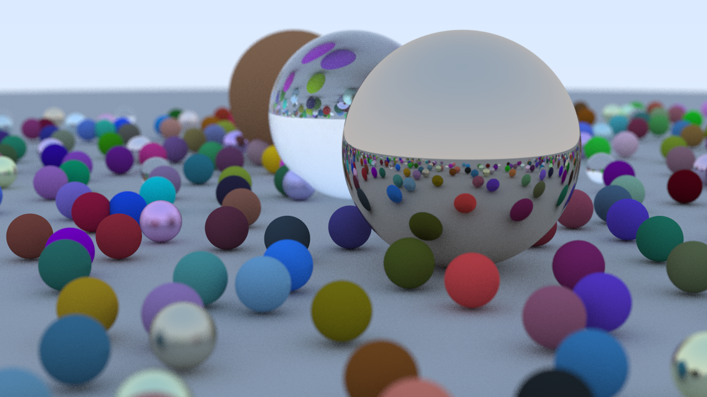

# Rust Raytracer

A simple Rust implementation of the famous [Ray Tracing in One Weekend Series](https://raytracing.github.io/).

Currently the code covers the [Ray Tracing in one week](https://raytracing.github.io/books/RayTracingInOneWeekend.html) book.

## Additional features

* Multithreaded execution

## How to run

*You will need [Rust](https://www.rust-lang.org/) on your machine*

* Clone the repository in a directory of choice
* Open the terminal and run ```cargo build``` to build the executable and/or ```cargo run``` to build and run the executable

### Multithreading

* The app runs in single core mode by default, if you want to utilize all of your cores run the executable wit the ```parallel``` argument.
 using cargo: ```cargo run -- parallel```

## Render



## Final Note

This is my first Rust project, so it might not be very idiomatic.
The primary objectives of the project are to learn ray tracing techniques and become familiar with Rust :smile:
